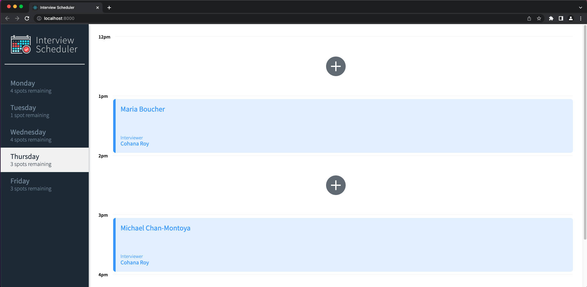
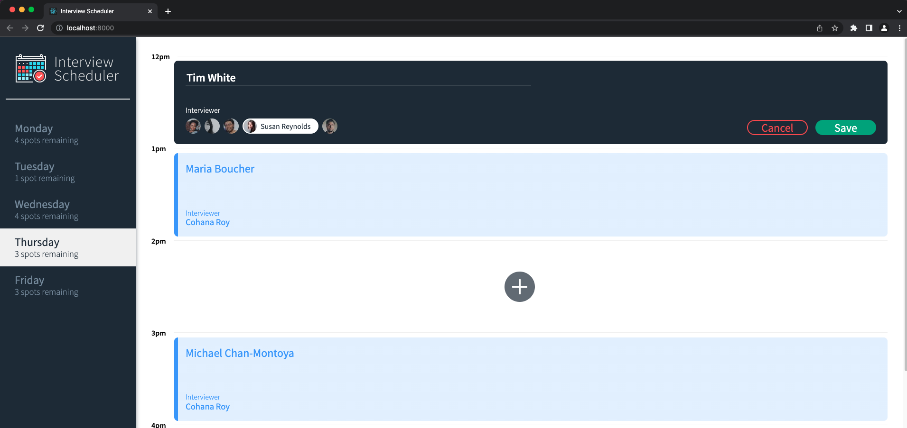
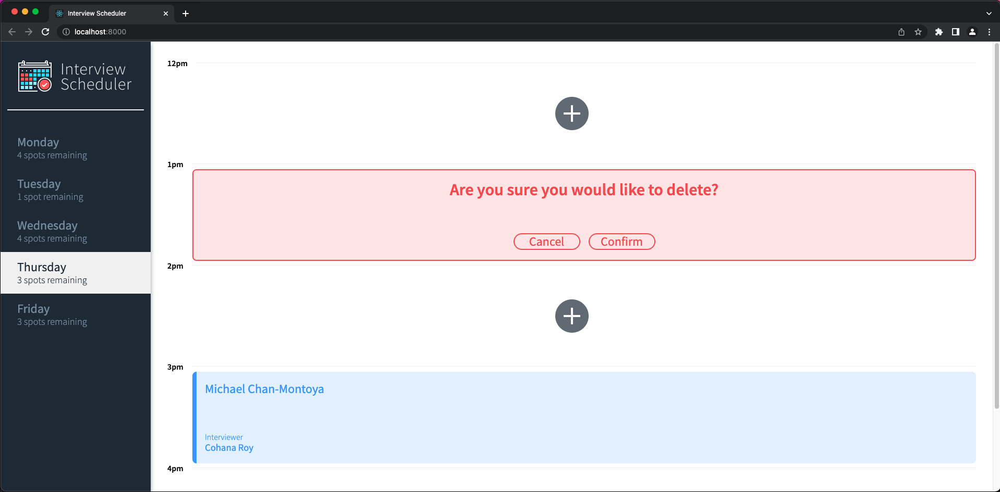

# Interview Scheduler

This app is built by React.js and for users to book, edit, or delete appointments.

## Screenshots

The home page UI



To book an appointment



Confirmation message when you delete an appointment



## Setup

Install dependencies with `npm install`.

P.S. DB can be installed at the [scheduler-api](https://github.com/wonth93/scheduler-api) repository

## Running Webpack Development Server

```sh
npm start
```

## Running Jest Test Framework

```sh
npm test
```

## Running Storybook Visual Testbed

```sh
npm run storybook
```
## Dependencies

* Axios
* React
* Storybook
* Cypress
* Jest
* PSQL
